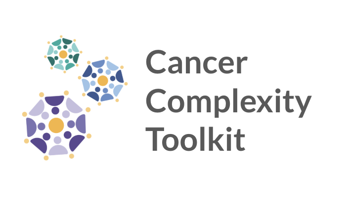

# Cancer Complexity Toolkit Workflow



## Description

The Cancer Complexity Toolkit Workflow is a scalable infrastructure framework to promote sustainable tool development. It performs multiple levels of analysis:

1. **Basic Repository Checks**
   - Repository cloning and validation
   - README file verification
   - Dependency file detection
   - Test suite presence

2. **Advanced Analysis**
   - [Software Gardening Almanack](https://github.com/software-gardening/almanack) analysis
   - JOSS (Journal of Open Source Software) criteria evaluation
   - AI-powered repository analysis (optional, requires Synapse agent ID)
   - Test execution and coverage

3. **Optional Synapse Integration**
   - Results upload to Synapse platform
   - Metadata management

## Requirements

### Core Dependencies
- **Nextflow** (version 24.04.3 or later): Install from [Nextflow's official website]. Install instructions below (https://www.nextflow.io/).
- **Docker** (required for containerized execution): Install from [Docker's official website](https://www.docker.com/get-started).
- **Python 3.8+**: Install from [Python's official website](https://www.python.org/downloads/).
- **Git**

> [!IMPORTANT]
> Docker is required to run this workflow. The toolkit uses containerized processes to ensure consistent execution environments across different systems.

### Optional Dependencies
For Synapse integration:
- Synapse Python client
- Synapse authentication token
- Synapse configuration file

## Installation

1. **Install Nextflow**
```bash
curl -s https://get.nextflow.io | bash
```

2. **Install Python Dependencies**
```bash
pip install -r requirements.txt
```

3. **Configure Synapse** (Optional)
```bash
# Create Synapse config file
mkdir -p ~/.synapse
touch ~/.synapseConfig
```

> [!NOTE]
> To use Synapse features, you'll need to:
> 1. Create a personal access token from your [Synapse Account Settings](https://help.synapse.org/docs/Managing-Your-Account.2055405596.html#ManagingYourAccount-PersonalAccessTokens)
> 2. Add the token to your `~/.synapseConfig` file:
>    ```
>    [authentication]
>    username = your_username
>    apiKey = your_personal_access_token
>    ```
> 3. Set the token as a Nextflow secret:
>    ```bash
>    nextflow secrets set SYNAPSE_AUTH_TOKEN your_personal_access_token
>    ```

## Usage

### Input Format

The workflow accepts input in two formats:

1. **Single Repository URL**
```bash
nextflow run main.nf --repo_url https://github.com/example/repo.git
```

2. **Sample Sheet (CSV)**

Example `input.csv`:
```csv
repo_url,description
https://github.com/PythonOT/POT.git,Python Optimal Transport Library
https://github.com/RabadanLab/TARGet.git,TARGet Analysis Tool
```

### Running the Workflow

#### Basic Analysis
```bash
nextflow run main.nf --repo_url https://github.com/example/repo.git
```

#### With AI Analysis
```bash
nextflow run main.nf \
    --repo_url https://github.com/example/repo.git \
    --synapse_agent_id LOWYSX3QSQ
```

#### With Sample Sheet
```bash
nextflow run main.nf --sample_sheet input.csv
```

> [!NOTE]
> When using AI Analysis or Synapse integration, ensure you have:
> - Valid Synapse authentication token
> - Proper Synapse configuration
> - Synapse agent ID for AI analysis (e.g., LOWYSX3QSQ)
> - Correct folder ID with write permissions (for upload)

## Output

The workflow generates several output files in the `results` directory:

- `<repo_name>_ai_analysis.json`: AI-powered qualitative summary and recommendations (final report)
- `almanack_results.json`: Detailed metrics from Almanack analysis
- `joss_report_<repo_name>.json`: JOSS criteria evaluation metrics
- `test_results_<repo_name>.json`: Test execution results and coverage metrics

> [!NOTE]
> The AI analysis report provides a high-level qualitative summary and actionable recommendations. For detailed metrics and specific measurements, refer to the other output files.

## Development Status

> [!WARNING]
> The AI Analysis component is currently in beta. Results may vary and the interface is subject to change.

> [!IMPORTANT]
> Synapse integration requires proper authentication and permissions setup.

## Example Repositories

| Repository | Description | Expected Status |
|------------|-------------|----------------|
| [PythonOT/POT](https://github.com/PythonOT/POT) | Python Optimal Transport Library | All checks pass |
| [RabadanLab/TARGet](https://github.com/RabadanLab/TARGet) | TARGet Analysis Tool | Fails dependency and test checks |
| [arjunrajlaboratory/memSeqASEanalysis](https://github.com/arjunrajlaboratory/memSeqASEanalysis) | memSeq ASE Analysis | Fails dependency and test checks |

## Configuration

### Synapse Configuration

**Authentication Token**
   - Set as Nextflow secret:
   ```bash
   nextflow secrets set SYNAPSE_AUTH_TOKEN your_personal_access_token
   ```

## Contributing

> [!NOTE]
> We welcome contributions! Please see our [Contributing Guidelines](CONTRIBUTING.md) for details.

## License

This project is licensed under the MIT License - see the [LICENSE](LICENSE) file for details. 