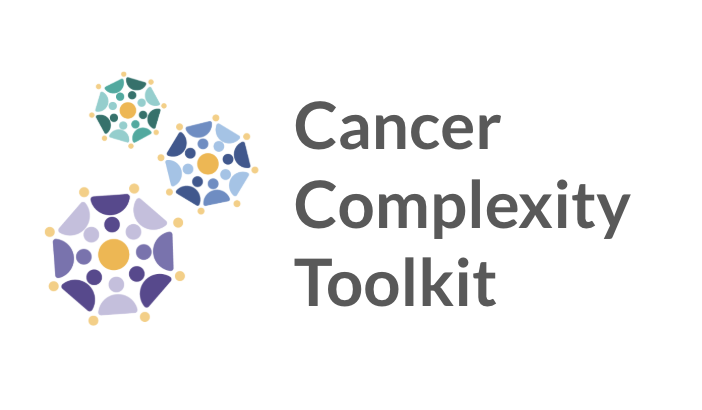

# Cancer Complexity Toolkit Workflow



## Description

The Cancer Complexity Toolkit Workflow is a scalable infrastructure framework to promote sustainable tool development. It performs multiple levels of analysis:

1. **Basic Repository Checks**
   - Repository cloning and validation
   - README file verification
   - Dependency file detection
   - Test suite presence

2. **Advanced Analysis**
   - [Software Gardening Almanack](https://github.com/software-gardening/almanack) analysis
   - JOSS (Journal of Open Source Software) criteria evaluation
   - AI-powered repository analysis (optional, requires an Anthropic API key)
   - Test execution and coverage

## Requirements

### Core Dependencies
- **Nextflow** (version 24.04.3 or later): see [nextflow.io](https://www.nextflow.io/), or the install command below.
- **Java 11 or later**, which Nextflow itself runs on.
- **Docker** (required for containerized execution): Install from [Docker's official website](https://www.docker.com/get-started).
- **Git**
- **A GitHub personal access token**: export it as `GITHUB_TOKEN` before launching.

> [!IMPORTANT]
> Docker is required to run this workflow. The toolkit uses containerized processes to ensure consistent execution environments across different systems.

> [!IMPORTANT]
> The Almanack analysis reads `GITHUB_TOKEN` to authenticate the GitHub API calls behind its
> remote metrics (stars, forks, subscribers, issue counts). Authenticated requests are limited
> to 5,000 an hour against 60 unauthenticated, so without a token those metrics come back empty
> for most repositories in any run larger than a handful. The workflow still runs without one.
> A classic token with the `public_repo` scope is enough; create one at
> [github.com/settings/tokens](https://github.com/settings/tokens). On the Seqera Platform, add
> it as a workspace secret named `GITHUB_TOKEN` instead. Never commit the token.

### Optional Dependencies
- **An Anthropic API key**: only for the AI analysis stage, which is off by default.

## Installation

1. **Install Nextflow**
```bash
curl -s https://get.nextflow.io | bash
```

2. **Export the credentials the run needs**
```bash
export GITHUB_TOKEN=...       # Almanack's GitHub API calls
export ANTHROPIC_API_KEY=...  # only if --run_ai_analysis true
```

Each process installs its own Python dependencies inside its container, so nothing needs
to be installed on the host beyond Nextflow, Docker, and Git.

> [!NOTE]
> Both must be exported into the launching shell. Neither is read from the repository's
> `.env` file, which the analysis scripts use but the workflow's processes do not see.
> Neither is a Nextflow secret either, so a run without them still completes: the Almanack
> falls back to unauthenticated API calls, and the AI analysis writes an error report
> rather than failing the run.

## Usage

### Input Format

The workflow accepts input in two formats:

1. **Single Repository URL**
```bash
nextflow run main.nf --repo_url https://github.com/example/repo.git
```

2. **Sample Sheet (CSV)**

A `repo_url` column is required; any other columns are read past, so column order does not
matter. `example-input.csv` in the repository root is a working sheet:
```csv
repo_url,description
https://github.com/PythonOT/POT.git,Python Optimal Transport Library
https://github.com/RabadanLab/TARGet.git,TARGet Analysis Tool
```

### Running the Workflow

#### Basic Analysis
```bash
nextflow run main.nf --repo_url https://github.com/example/repo.git
```

#### With AI Analysis
```bash
export ANTHROPIC_API_KEY=...
nextflow run main.nf \
    --repo_url https://github.com/example/repo.git \
    --run_ai_analysis true
```

#### With Sample Sheet
```bash
nextflow run main.nf --sample_sheet example-input.csv
```

> [!NOTE]
> The AI analysis is off by default (`run_ai_analysis = false`). It sends the repository's
> Almanack and JOSS results to the Anthropic API and asks for an HTML report, so it needs
> `ANTHROPIC_API_KEY` exported in the launching shell. Without the key the stage still runs
> and writes a report saying the key was not configured.

## Output

The workflow generates several output files in the `results` directory:

- `<repo_name>_almanack_Results.json`: Detailed metrics from Almanack analysis
- `joss_report_<repo_name>.json`: JOSS criteria evaluation metrics
- `test_results_<repo_name>.json`: Test execution results and coverage metrics
- `<repo_name>_status_repo.txt`, `status_almanack_<repo_name>.txt`: Per-stage pass/fail status
- `<repo_name>_ai_analysis.html`: AI-powered qualitative summary and recommendations, when
  `--run_ai_analysis true`

> [!NOTE]
> The AI analysis report provides a high-level qualitative summary and actionable recommendations. For detailed metrics and specific measurements, refer to the other output files.

## Development Status

> [!WARNING]
> The AI Analysis and Test Executor components are currently in beta. Results may vary and the interface is subject to change.

> [!WARNING]
> The Test Executor's output is reported but does not set the JOSS Tests criterion. Whether a
> suite runs inside the workflow container depends on the project's dependencies resolving
> there, and on the executor supporting its language at all (Python and Node only, though the
> project-type detector recognises R, Maven, Gradle, Rust and Go). A project with a full suite
> and passing CI cannot reliably be told apart from a project with no tests. The criterion is
> instead read from the repository's contents: a suite wired to continuous integration, a
> suite alone, sample inputs a reviewer could run by hand, or no evidence. Execution results
> still appear in the criterion's details, since a suite that runs and fails is worth seeing.

## Example Repositories

| Repository | Description | Expected Status |
|------------|-------------|----------------|
| [PythonOT/POT](https://github.com/PythonOT/POT) | Python Optimal Transport Library | All checks pass |
| [RabadanLab/TARGet](https://github.com/RabadanLab/TARGet) | TARGet Analysis Tool | Fails dependency and test checks |
| [arjunrajlaboratory/memSeqASEanalysis](https://github.com/arjunrajlaboratory/memSeqASEanalysis) | memSeq ASE Analysis | Fails dependency and test checks |

## Configuration

### Seqera Platform (Nextflow Tower)

Large runs are launched on the [Seqera Platform](https://seqera.io/platform/) (formerly
Nextflow Tower), a hosted service for launching, monitoring, and logging Nextflow runs
without managing the compute yourself. Sage's instance is at `tower.sagebionetworks.org`.

Two things in this repository exist only for that path:

- The `tower` profile in `nextflow.config` switches the executor to AWS Batch and points
  the work and output directories at S3 instead of the local filesystem.
- `tower_params.json` is the params file handed to the platform at launch. It sets
  `output_dir` to an S3 prefix and `sample_sheet` to a dataset URL served by the platform.

```bash
nextflow run main.nf -profile tower -params-file tower_params.json
```

Neither is needed to run the workflow locally; the commands under
[Running the Workflow](#running-the-workflow) use the default local executor.

On the Seqera Platform, add `GITHUB_TOKEN` and `ANTHROPIC_API_KEY` as workspace secrets
instead of exporting them.

## Contributing

> [!NOTE]
> We welcome contributions! Please see our [Contributing Guidelines](CONTRIBUTING.md) for details.

## License

This project is licensed under the MIT License - see the [LICENSE](LICENSE) file for details. 