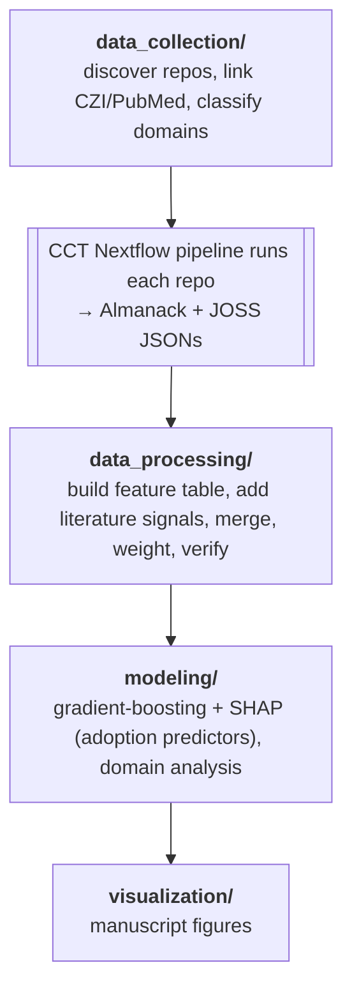

# Analysis code

Reproducible analysis for the accompanying manuscript.
It consumes the per-repository measurements produced by the Cancer Complexity Toolkit (CCT) Nextflow pipeline (in the repository root) and produces the statistics and figures in the paper.

## Setup

Dependencies are managed with [uv](https://docs.astral.sh/uv/) via `analysis/pyproject.toml`, and `analysis/uv.lock` pins the exact versions last used for the manuscript.

```bash
# from the repository root
uv sync --project analysis                          # core deps (figures/modeling)
uv sync --project analysis --extra data-collection  # add repo discovery / classification deps
```

Run any code through uv so it uses the locked environment; work **from the repository root** so relative default paths resolve:

```bash
uv run --project analysis python analysis/modeling/stars_shap_model.py --help
```

All code uses argparse with sensible defaults.
Pass `--help` to any script to see its options.

## Data

The code reads from and writes to `data/final_results/`.
That directory is intentionally **ignored** (it holds large derived data).
Ignored data is released separately with the manuscript.
Once the archive is deposited, its DOI is recorded in the repository's `CITATION.cff` (under `references:`) and in the Data and Code Availability section of the paper.
To reproduce, download the released data bundle and place it at `data/final_results/` so the default paths resolve.
Key files:

| File | Contents |
|---|---|
| `almanack_metrics.csv` | One row per tool, all Almanack metrics (built from the CCT JSON outputs) |
| `combined_almanack_full_classified_with_joss.csv` | Full joined table: Almanack checks + JOSS scores + CZI mentions + domain labels (the canonical analysis table) |
| `aggregated_data_llm_classified.csv` | `tool_name`, `domain` (LLM-classified) |
| `weights_logistic_refit.csv` | nf-core-calibrated logistic weights per check |
| `nf_core_almanack_metrics.csv` | Almanack metrics for nf-core pipelines |
| `test_evidence_static.csv` | Per-repository test evidence flags and the static JOSS Tests score |
| `revision/event_candidates.csv` | The cohort the fork accrual chain iterates over |
| `revision/fork_history/<owner>__<repo>.csv` | One fork `created_at` per row, ascending |
| `revision/*_events.jsonl` | Practice adoption dates, one JSON record per repository |

Some code consumes **raw inputs that are not in the data bundle** because they are large or regenerable: the per-repo Almanack JSON directory (CCT pipeline output) consumed by `build_almanack_metrics_table.py`.
All data needed for the figures is in the released tables.

## Pipeline (run order)



## Results by code that produced them

Described by output content rather than manuscript figure numbers, which can change as the manuscript is revised.

| Result | Script |
|---|---|
| Conceptual framework; cohort funnel | `visualization/generate_conceptual_figures.py` |
| Check pass rates; domain violin | `visualization/generate_results_figures.py` |
| SHAP adoption predictors (stars) | `modeling/stars_shap_model.py` |
| Mentions panel / robustness | `modeling/mentions_shap_model.py` |
| Longitudinal evolution, grading | `visualization/benchmark_analysis.py` |
| Domain ANOVA + residuals | `modeling/stars_domain_analysis.py`, `data_processing/apply_logistic_weights_and_domain_anova.py`, `modeling/weighted_scores_statistical_analysis.py` |
| Score distributions (supplementary) | `visualization/plot_almanack_score_distributions.py` |
| Fork accrual after practice adoption, both directions | `modeling/matched_did_practice_forks.py`, `modeling/reverse_direction_adoption.py` |

## Fork accrual around practice adoption

The cross-sectional models above say practices and adoption coincide, not which comes first.
This chain addresses precedence, using fork accrual as the time-resolved adoption proxy: GitHub
does not expose historical star counts, but the forks endpoint returns a `created_at` per fork,
so a cumulative series can be reconstructed for any repository.

Run order, from the repository root:

```bash
# 1. Fork history, one resumable cache file per repository
uv run --project analysis python analysis/modeling/reconstruct_fork_history.py

# 2. Score the Tests criterion from repository contents. Steps 2b and 3 read the table it
#    writes to decide which repositories count as having a test suite
uv run --project analysis python analysis/data_collection/detect_test_evidence.py

# 2b. Date each practice's adoption. Four collectors, one per evidence type
uv run --project analysis python analysis/modeling/date_practice_events.py          # license, citation files
uv run --project analysis python analysis/data_collection/date_citability_events.py # citability, all routes
uv run --project analysis python analysis/data_collection/date_test_events.py       # test suite
uv run --project analysis python analysis/data_collection/date_docs_events.py       # docs, contributing, code of conduct

# 3. Matched difference-in-differences, all six practices
uv run --project analysis python analysis/modeling/matched_did_practice_forks.py

# 4. The reverse direction: does forking predict adoption?
uv run --project analysis python analysis/modeling/reverse_direction_adoption.py
```

Every collector is resumable, appending one record per repository and skipping those already
present, so a run can be stopped and grown incrementally.

Two things to know before rerunning:

- `modeling/practice_event_study.py` is retired as an analysis, but step 3 reads the license
  practice's event dates from its output, so it has to run between steps 2b and 3. It filters
  3,568 dated license additions to 614 first, which makes the license row's treated pool
  narrower than the other five practices'. Its docstring records what the estimate does when
  that filter is dropped.
- `event_candidates.csv`, the cohort steps 1 and 2 iterate over, has no generator in this
  repository. It is a subset of the metrics table (`tool_name`, `owner_repo`, fork and star
  counts, license and citability flags, commit time range, source URL) and ships in the data
  bundle.

## Reproducing the headline results

```bash
# Sustainability-only adoption predictors (license, citability, modern branch top-ranked)
uv run --project analysis python analysis/modeling/stars_shap_model.py --sustainability_only

# Full adoption model (social signals included)
uv run --project analysis python analysis/modeling/stars_shap_model.py

# Domain analysis
uv run --project analysis python analysis/modeling/stars_domain_analysis.py

# Check pass rates + domain violin
uv run --project analysis python analysis/visualization/generate_results_figures.py
```

Outputs land in `data/final_results/` (tables) and `docs/manuscript_drafts/figures/` (figures).

## Notes

- **Run from the repository root** so relative default paths (`data/final_results/...`) resolve.
- **API keys** are loaded from a git-ignored `.env` file (or the real environment), never hardcoded.
  Copy `.env.template` (repo root) to `.env` and fill in what you need: `GITHUB_TOKEN` and `ANTHROPIC_API_KEY` for the data-collection/classification scripts, plus `GEMINI_API_KEY` / `OPENAI_API_KEY` for the alternate classifiers in `analysis/archive/`.
- Personal/operational scripts (S3 reparse, shell helpers) and superseded data-assembly steps (`recompute_logistic_weights`, `combine_external_datasets`) live in `analysis/archive/` and are not needed to reproduce the paper; the tables they would produce are in the released bundle.
- Domains were classified with `data_collection/classify_domains_primary.py` (primary, Anthropic API) and `data_collection/classify_domains_other.py` ("Other" bucket, via Bedrock).
  Alternate LLM-provider classifiers that were not used live in `analysis/archive/`.
- Random seeds are fixed (42) and bootstrap/permutation steps are seeded, so results are deterministic.
