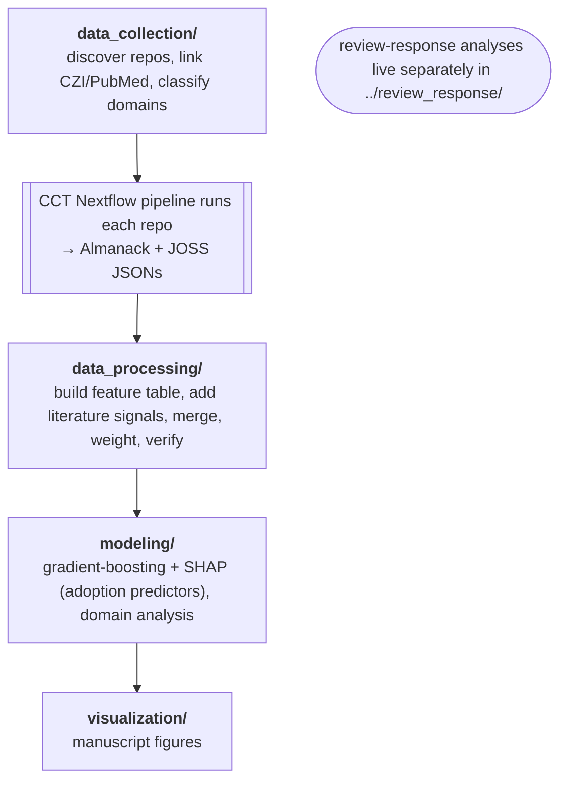

# Analysis code: "Mapping the Garden"

Reproducible analysis for the manuscript *Mapping the Garden: Software Sustainability as a Correlate of Scientific Impact Across Computational Biology Ecosystems*.
This analysis uses the per-repository measurements produced by the Cancer Complexity Toolkit (CCT) Nextflow pipeline (in the repository root) and produce the statistics and figures in the paper.

## Setup

Dependencies are managed with [uv](https://docs.astral.sh/uv/) via `analysis/pyproject.toml`, and `analysis/uv.lock` pins the exact versions last used for the manuscript.

```bash
# from the repository root
uv sync --project analysis                          # core deps (figures/modeling)
uv sync --project analysis --extra data-collection  # add repo discovery / classification deps
```

Run any code through uv so it uses the locked environment; work **from the repository root** so relative default paths resolve:

```bash
uv run --project analysis python analysis/modeling/stars_shap_model.py --help
```

All code uses argparse with sensible defaults.
Pass `--help` to any script to see its options.

## Data

The code reads from and writes to `data/final_results/`.
That directory is intentionally **ignored** (it holds large derived data).
Ignored data is released separately with the manuscript (see the Data and Code Availability section of the paper for the DOI).
To reproduce, download the released data bundle and place it at `data/final_results/` so the default paths resolve.
Key files:

| File | Contents |
|---|---|
| `almanack_metrics.csv` | One row per tool, all Almanack metrics (built from the CCT JSON outputs) |
| `combined_almanack_full_classified_with_joss.csv` | Full joined table: Almanack checks + JOSS scores + CZI mentions + domain labels (the canonical analysis table) |
| `aggregated_data_llm_classified.csv` | `tool_name`, `domain` (LLM-classified) |
| `weights_logistic_refit.csv` | nf-core-calibrated logistic weights per check |
| `nf_core_almanack_metrics.csv` | Almanack metrics for nf-core pipelines |

A few scripts consume **raw inputs that are not in the data bundle** because they are large or regenerable: the per-repo Almanack JSON directory (CCT pipeline output) consumed by `build_almanack_metrics_table.py`.
Everything needed for the figures is in the released tables.

## Pipeline (run order)



## Which script makes which figure / result

| Manuscript item | Script |
|---|---|
| Figure 1 (conceptual framework), Figure 2 (cohort funnel) | `visualization/generate_conceptual_figures.py` |
| Figure 3 (check pass rates), Figure 4 (domain violin) | `visualization/generate_results_figures.py` |
| Figure 5 (SHAP adoption predictors, stars) | `modeling/stars_shap_model.py` |
| Figure 5 mentions panel / robustness | `modeling/mentions_shap_model.py` |
| Figure 6 (longitudinal evolution, grading) | `visualization/benchmark_analysis.py` |
| Section 4.2 domain ANOVA + residuals | `modeling/stars_domain_analysis.py`, `data_processing/apply_logistic_weights_and_domain_anova.py`, `modeling/weighted_scores_statistical_analysis.py` |
| Score distributions (supplementary) | `visualization/plot_almanack_score_distributions.py` |
| Review-response analyses (supplementary) | `../review_response/` (separate top-level folder) |

## Reproducing the headline results

```bash
# Figure 5: sustainability-only adoption predictors (license, citability, modern branch top-ranked)
uv run --project analysis python analysis/modeling/stars_shap_model.py --sustainability_only

# Figure 5 full model (social signals included)
uv run --project analysis python analysis/modeling/stars_shap_model.py

# Domain analysis (Section 4.2)
uv run --project analysis python analysis/modeling/stars_domain_analysis.py

# Figures 3 and 4
uv run --project analysis python analysis/visualization/generate_results_figures.py
```

Outputs land in `data/final_results/` (tables) and `docs/manuscript_drafts/figures/` (figures).

## Review-response analyses

Analyses added in response to peer review live in the separate top-level `review_response/` folder, kept apart from the main manuscript pipeline.
See [../review_response/README.md](../review_response/README.md).

## Notes

- **Run from the repository root** so relative default paths (`data/final_results/...`) resolve.
- **API keys** are read from environment variables, never hardcoded: `ANTHROPIC_API_KEY`, `GITHUB_TOKEN`, and `GEMINI_API_KEY` / `OPENAI_API_KEY` for the alternate classifiers.
- Personal/operational scripts (S3 reparse, shell helpers) and superseded data-assembly steps (`recompute_logistic_weights`, `combine_external_datasets`) live in `analysis/archive/` and are not needed to reproduce the paper; the tables they would produce are in the released bundle.
- Domains were classified with `data_collection/classify_domains_claude.py` (primary) and `data_collection/classify_batch_bedrock.py` ("Other" bucket).
  Alternate LLM-provider classifiers that were not used live in `analysis/archive/`.
- Random seeds are fixed (42) and bootstrap/permutation steps are seeded, so results are deterministic.
